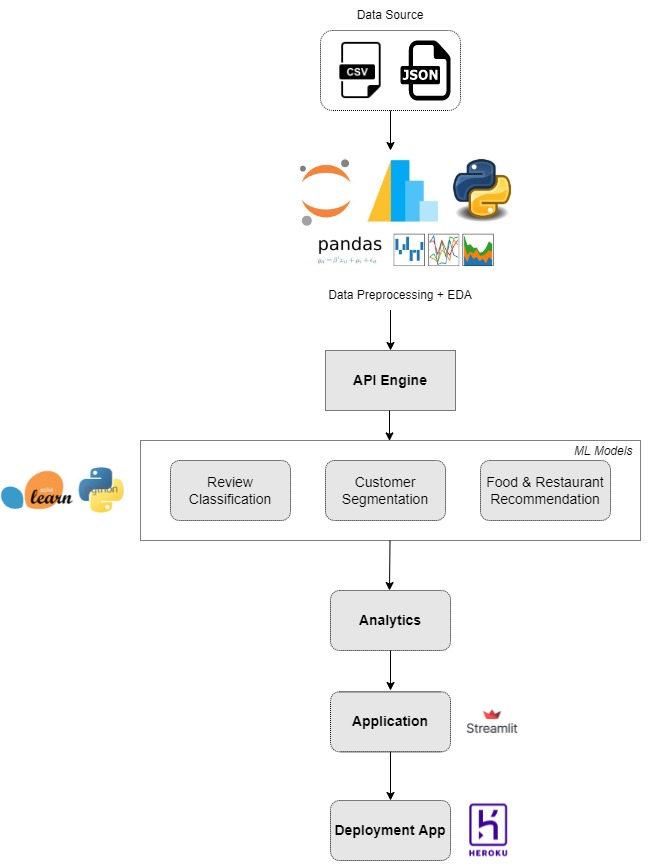

# **INFO 7374 - Algorithmic Digital Marketing FALL 2021**

# **Yelp Restaurant Recommendation System**

**By:**

**Rakshith Chandrashekar - 001006556**

**Sanjit Sateesh - 001090471**

United States is the home for many popular cuisine and restaurants. These cuisines bring a homely feeling to millions of people in the United States who has an affinity towards their own cultural cuisine and many new cuisines which are popular all around the world.

Yelp is a public corporation based in San Francisco, California that provides a business directory service and a crowd-sourced review platform. Yelp.com and the Yelp mobile app, which publish crowd-sourced evaluations about establishments, are developed, hosted, and marketed by the company.

A recommendation system with help of reviews and data on YELP would help us build a robust system which can personalize restaurant and cuisines for each and every individual. This system helps the restaurant industry and all the foodies across the United States.

# **GOALS:**
- Restaurant recommendation system using Yelp data would be a combination of the restaurant and cuisine data, which has the potential to generate a significant extra revenue stream through digital marketing.
- We offer a simple system which can recommend the restaurant that a user would want to visit based on their search pattern, reviews provided, based on their yelp search history, cuisine liking etc. Any restaurant might use these data to find customers who could enjoy their establishment. If the user considers the recommendations to be correct, there's a good possibility they'll use Yelp more frequently and rate new eateries.
- This would be good to Yelp once again, as it would enhance Yelp's usage among users.
- And with help of YELP, we can provide more personalized results for our customers on our recommendation system.
- There is a positive feedback loop since more users means more advertising money, more user information, more insights, and eventually more revenue from selling the restaurant's customer insights.

# **DATA:**
- YELP Data: <https://www.yelp.com/dataset>

We will use the data that’s available on YELP and use that to build a robust system.
- <https://www.kaggle.com/glorialmcretella/yelp-business>
- <https://www.kaggle.com/hanfanwang/yelp-review>

# **PROCESS OUTLINE:**

- Data preprocessing
- Data Cleaning, handling missing values
- Exploratory Data Analysis
- Customer Segmentation: Based on frequency, recency, monetary and type of restaurant selection.
- Restaurant classification based on the reviews given by the customers.
- Restaurant and cuisine recommendation based on geospatial location and previous orders.
- Design of a pipeline and system to implement this approach and discussion on the system’s Capabilities.
- Deploy the application using stream lit and then Heroku to demonstrate the prediction and recommendation results, dashboards including analysis of customer segmentation, frequency of cuisines selection, top items ordered, top customer, sales/orders over months, future forecasting for upcoming months.

# **CONTENTS ON GitHub:**

-	Raw Data 
-	Preprocessed data 
-	Data preprocessing scripts 
-	Scripts to push the data into S3
-	Customer segmentation script 
-	Restaurant classification based on reviews 
-	Recommendation
-	Streamlit
-	Heroku

# **DEPLOYMENT DETAILS:**

# **REFERENCES:**
- <https://docs.streamlit.io/>
- <https://gilberttanner.com/blog/deploying-your-streamlit-dashboard-with-heroku>
- <https://github.com/Data-Science-Community-SRM/Food-Recommendation-System>
- <https://medium.com/@sumith.gannarapu/restaurant-recommendation-system-b52911d1ed0b>

